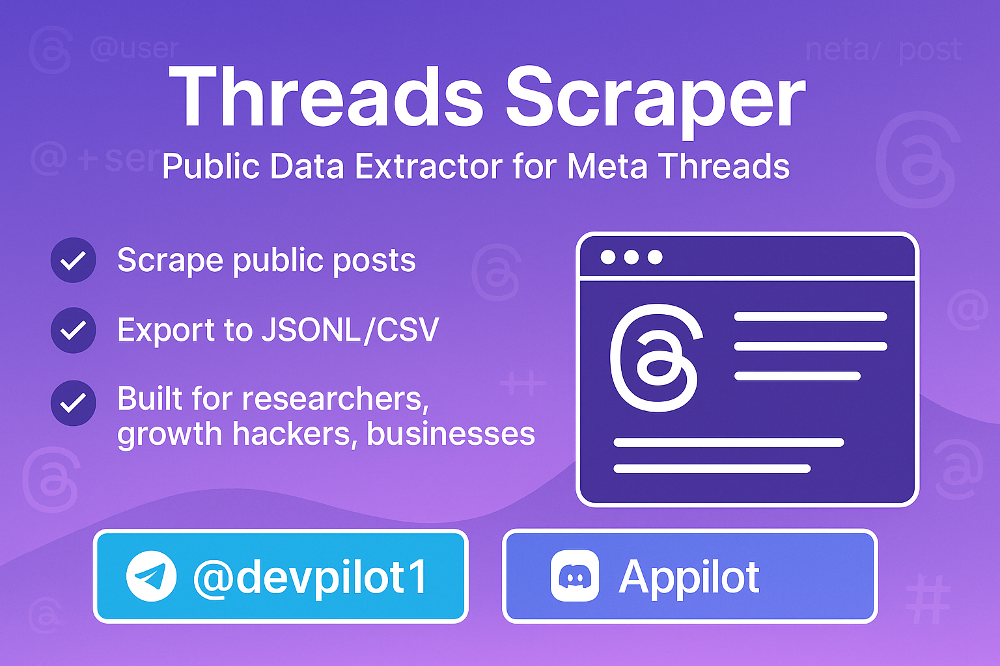

  <h1>Threads Scraper – Public Data Extractor for Meta Threads</h1>

  
  
  
  
  

A lightweight and flexible **Threads Scraper** designed to solve the **frustration of manual data collection** from [Threads.net](https://www.threads.net/).

Marketers, researchers, and businesses spend countless hours trying to copy-paste posts or depend on unreliable third-party tools. **This scraper changes that** — delivering fast, structured, and reliable Threads data so you can focus on **insights, growth, and results**, not the grunt work.

For full access and custom solutions, reach out via [Telegram](https://t.me/devpilot1) or [Discord](https://discord.gg/vBu9huKBvy).

##

---

##  Overview
Threads is Meta’s fast-growing social platform. With millions of users sharing posts daily, **accessing public data** is essential for:  
- Tracking competitors  
- Analyzing market trends  
- Monitoring engagement metrics  
- Building AI datasets  
- Powering research projects  

The **Threads Scraper** provides a simple way to **automate data collection** without manual copy-pasting.  

---

##  Features
- **Public Profile Scraping** → Collect posts from any username.  
- **Export Options** → Save results in JSONL or CSV formats.  
- **Command-Line Tool** → Easy to run with simple flags.  
- **Polite Automation** → Throttling, retries, and headless browser support.  
- **Extendable** → Can be adapted for hashtags, comments, or bulk profiles.  

---

##  Why Use This?
-  **Save Time** – no more manually collecting Threads posts.  
-  **Better Insights** – analyze engagement, sentiment, and trends quickly.  
-  **Scale Easily** – run on multiple accounts or hashtags.  
-  **Integrate Anywhere** – outputs structured data ready for CRMs, dashboards, or AI pipelines.  
-  **Future-Ready** – as Threads grows, data is key for marketers, agencies, and businesses.  

---

##  Use Cases
- **Agencies & Marketers** → Track competitors’ strategies.  
- **E-commerce & Brands** → Monitor niche trends and audience behavior.  
- **Researchers & Analysts** → Collect datasets for social media research.  
- **Automation Enthusiasts** → Learn Playwright + scraping with a real example.  

---
## 🏗️ Architecture

##  Contact
If you need **custom scraping, automation systems, or SaaS dashboards** for Threads or other platforms, get in touch:  

- **Telegram** → [@devpilot1](https://t.me/devpilot1)  
- **Discord Server** → [Appilot](https://discord.gg/vBu9huKBvy)  

##

  

