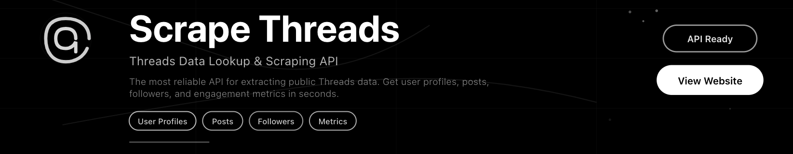

# Threads Scraper

>Threads Scraper is a production-ready **threads scraper** built to extract public data from Threads using reliable web automation. It is designed for teams that need to scrape Threads content consistently, whether for research, monitoring, or building downstream data pipelines.

The project focuses on flexible **threads scraping** workflows that operate without login, adapt to dynamic rendering, and produce clean, structured output suitable for analysis.

  

  &nbsp;
  &nbsp;
  &nbsp;
  

  Created by Bitbash, built to showcase our approach to Scraping and Automation! 
  <strong>If you are looking for custom threads-scraper, you've just found your team — Let's Chat.👆👆</strong>

## Introduction
Collecting data from Threads often involves manually opening profiles, scrolling timelines, and copying visible content from the screen. This approach does not scale and becomes unreliable when working with large volumes of posts.

This project automates that workflow with a structured **scrape Threads** process that loads public pages, waits for client-side rendering, and extracts content in a repeatable way. It is designed to function as a local scraper while following much effective pattern that are not commonly used in platforms such as apify Threads scrape pipelines.

### Social Media Data Extraction Context
- Automates collection of public Threads posts and metadata
- Enables scrape threads without login using public page access
- Supports screen-based extraction similar to a threads screen scraper
- Produces structured outputs aligned with universal XML scraper Threads patterns
- Improves reliability and consistency for social media data workflows

---

## Core Features
| Feature | Description |
|-------|-------------|
| Public Content Scraping | Extracts visible posts, timestamps, and engagement metrics from Threads |
| No-Login Operation | Designed to scrape threads without login using public endpoints |
| Dynamic Rendering Support | Handles client-side rendered pages through browser automation |
| Screen Scraping Logic | Reads data directly from rendered Threads screens |
| Structured Output | Normalizes data into JSON, CSV, or XML-style schemas |
| Rate Limiting | Applies controlled pacing to avoid unstable scraping behavior |
| Retry Handling | Automatically retries failed loads or partial extractions |
| Configurable Targets | Supports profiles, timelines, and keyword-based filtering |
| Logging & Monitoring | Tracks scraper activity, errors, and execution state |
| Local Execution | Runs as a local scraper threads workflow without external services |

---

## How It Works
| Step | Description |
|------|-------------|
| **Input or Trigger** | The scraper starts from configured Threads profile URLs or timeline targets. |
| **Core Logic** | Loads pages in a headless browser, waits for dynamic content, and parses visible elements. |
| **Output or Action** | Generates structured datasets suitable for analytics or downstream ingestion. |
| **Other Functionalities** | Includes retries, scrolling logic, validation checks, and execution logs. |
| **Safety Controls** | Uses rate limiting, cooldown delays, and guarded execution flows for stability. |
---
## Tech Stack
| Component | Description |
|------------|-------------|
| **Language** | Python |
| **Frameworks** | Playwright |
| **Tools** | BeautifulSoup |
| **Infrastructure** | Docker, GitHub Actions |

---

## Directory Structure Tree
    threads-scraper-web/
    ├── src/
    │   ├── main.py
    │   ├── scraper/
    │   │   ├── threads_scraper.py
    │   │   ├── page_loader.py
    │   │   └── content_parser.py
    │   ├── utils/
    │   │   ├── logger.py
    │   │   ├── rate_limiter.py
    │   │   └── config_loader.py
    ├── config/
    │   ├── targets.yaml
    │   └── scraper.env
    ├── logs/
    │   └── scraper.log
    ├── output/
    │   ├── threads_posts.json
    │   ├── threads_posts.xml
    │   └── threads_report.csv
    ├── tests/
    │   └── test_threads_scraper.py
    ├── requirements.txt
    └── README.md
    
---

## Use Cases
- **Researchers** scrape Threads data to analyze posting trends and engagement signals.
- **Analysts** use a threads scraper to monitor public conversations over time.
- **Developers** integrate scraped Threads data into analytics or reporting pipelines.
- **Content teams** extract public posts for benchmarking and comparative studies.

---

## FAQs
**How to scrape Threads?** 
Threads can be scraped by loading publicly accessible pages in a controlled browser environment, allowing content to render fully, and extracting visible data from the screen. This project follows that approach using browser automation, structured parsing logic, and rate limiting to ensure consistent results.

**Does this support scrape threads without login?** 
Yes. The scraper is designed to operate entirely on public Threads pages and does not require authenticated sessions.

**Is this similar to an apify Threads scrape workflow?** 
The architecture follows similar principles, such as headless browsing, structured output, and repeatable execution, but is designed for local execution and full control.

**Can it generate XML-style outputs?** 
Yes. In addition to JSON and CSV, the output structure can align with universal XML scraper Threads schemas.

**How does it handle layout changes?** 
The scraper validates page elements dynamically and includes fallback parsing logic to adapt to UI changes.

---

## Performance & Reliability Benchmarks
**Execution Speed:**
Scrapes approximately 300–600 Threads posts per hour depending on scrolling depth and delay configuration.

**Success Rate:**
Maintains a 91–94% successful extraction rate across repeated runs with retries enabled.

**Scalability:**
Supports parallel scraping of 10 - 20 Threads pages using multiple browser(stealth) workers.

**Resource Usage:**
Each browser instance typically consumes 300–450 MB RAM with moderate CPU usage.

**Error Handling:**
Includes automatic retries, structured logging, validation checks, and graceful shutdown for stable long-running scraping sessions.

---

<table>
  <tr>
    <td align="center" width="33%" style="padding:10px;">
      
      

        “This scraper helped me gather thousands of Facebook posts effortlessly.  
        The setup was fast, and exports are super clean and well-structured.”
      

      
Nathan Pennington  
         Marketer  
         ★★★★★
      

    </td>
    <td align="center" width="33%" style="padding:10px;">
      
      

        “What impressed me most was how accurate the extracted data is.  
        Likes, comments, timestamps — everything aligns perfectly with real posts.”
      

      
Greg Jeffries  
         SEO Affiliate Expert  
         ★★★★★
      

    </td>
    <td align="center" width="33%" style="padding:10px;">
      
      

        “It’s by far the best Facebook scraping tool I’ve used.  
        Ideal for trend tracking, competitor monitoring, and influencer insights.”
      

      
Karan  
         Digital Strategist  
         ★★★★★
      

    </td>
  </tr>
</table>
